# PRIME-Z390M-PLUS-9700K-5700XT-OPENCORE

>👉主板：ASUS-PRIME-Z390M-PLUS

>👉CPU：Intel Core i7-9700k 3.6GHz + 酷冷至尊 T520

>👉显卡：技嘉 5700XT 8G + 技嘉 750W 电源

>👉内存：金士顿 骇客神条 16G x 2

>👉固态：三星 PM961 256G + 西数 SN750 1T + 三星8 50EVO 500G

>👉网卡：博通 BCM943602CS

>👉显示：戴尔 P2418D 2K

>👉机箱：爱国者M1侧透 + 酷冷至尊 MF120L x 3

>👉BIOS：PRIME-Z390M-PLUS-ASUS-2808.CAP

---

>🍎系统：macOS Big Sur 11.1 (20C69)

>🍎引导：OpenCore 0.6.5

>🍎型号：iMac19,1

---

#### 目前状态

>✅CPU睿频正常

>✅核显驱动正常,硬解正常

>✅独显正常免驱(加设备参数后加速明显)

>✅主板网口正常

>✅主板3.5mm耳机口输出正常

>✅睡眠正常

>✅隔空投送正常,iMessage正常,FaceTime正常

>✅USB接口正常(已定制)

>✅开机不会卡F1

>✅正常关机

---

#### 安装记录

* [macOS Catalina 10.15.7(19H2) Installer for Clover 5122 and WEPE.dmg](https://cloud.189.cn/t/j6JRNzJNRB3y)

* [macOS Big Sur 11.0.1 20B50 Installer for CLOVER 5126 and OpenCore 0.6.3 and PE 32G.dmg](https://cloud.189.cn/t/EfQZvuqUN7Fn)

* [安装过程](./INSTALL.md)

* [苹果日常使用](https://gitee.com/liuzy1988/MyLinux/blob/master/MacOS_10.15.md)

---

#### 参考资料

* https://blog.daliansky.net/

* https://blog.xjn819.com/post/opencore-guide.html

* https://github.com/yanjifa/hackintosh-asus-prime-z390p_i9-9900k_rx5700xt

* https://www.yuque.com/hejianzhao/zgnsc5/ywakri

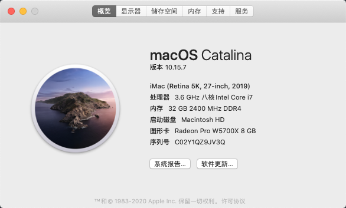
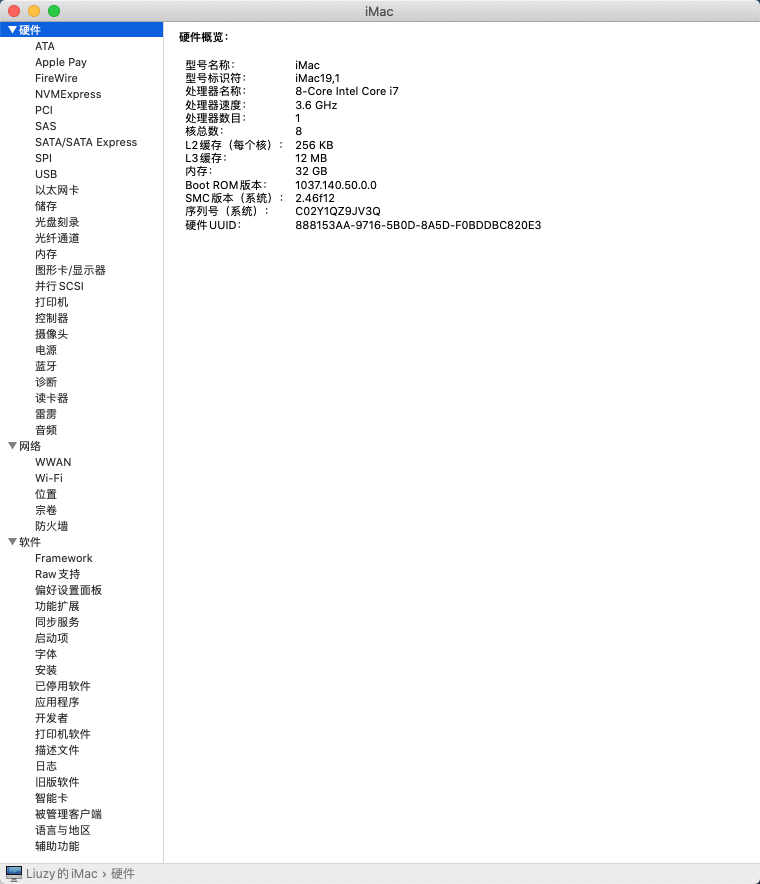
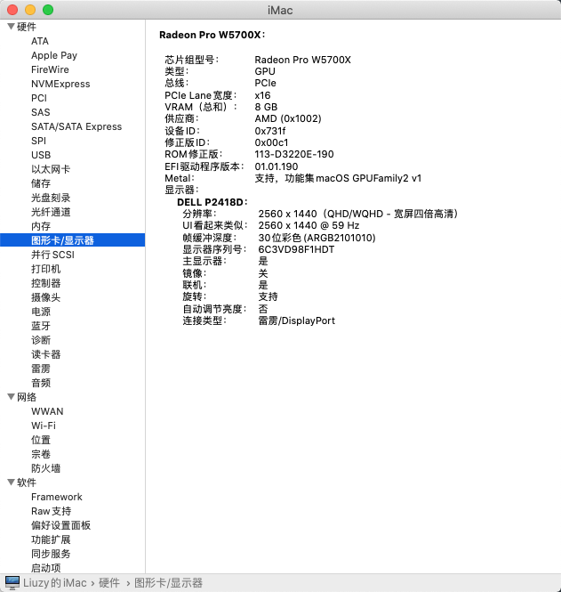
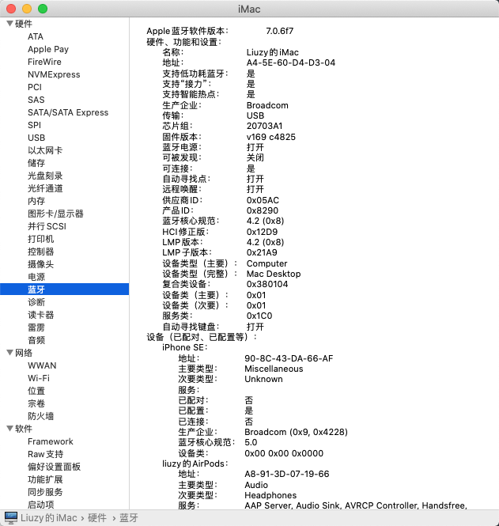
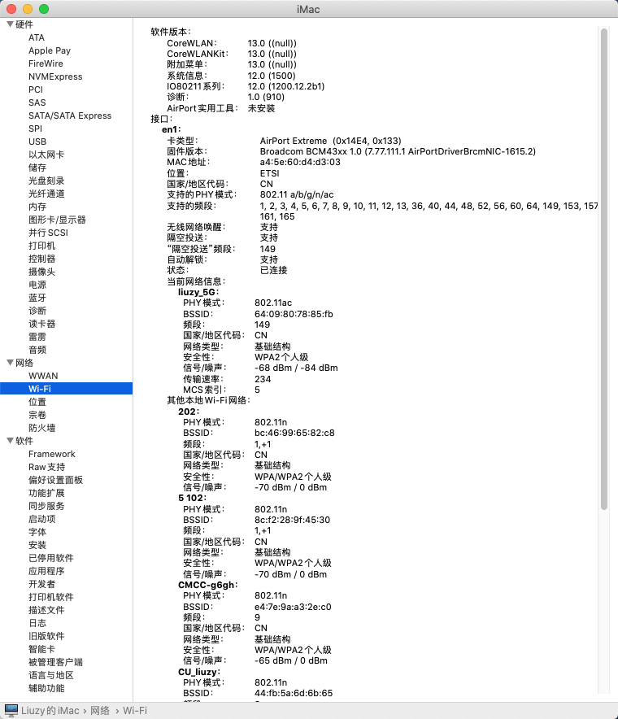
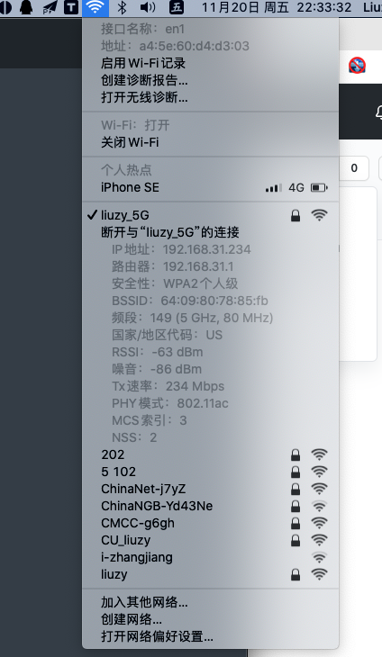
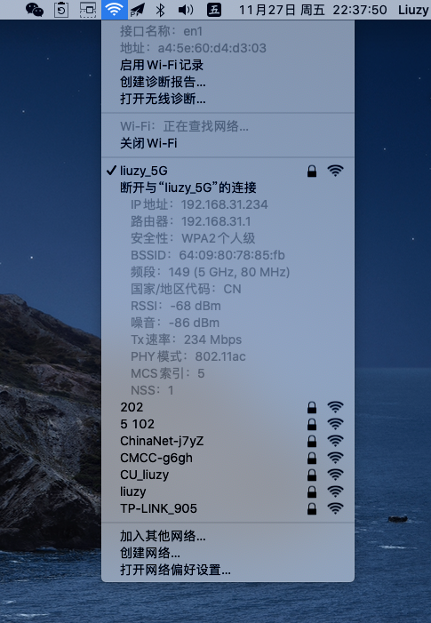
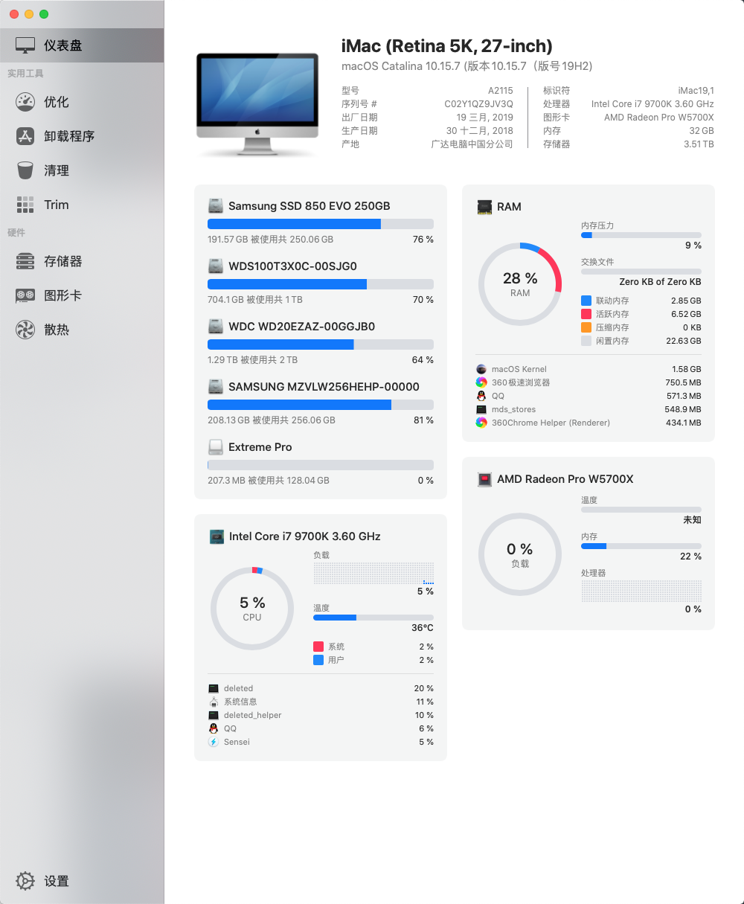

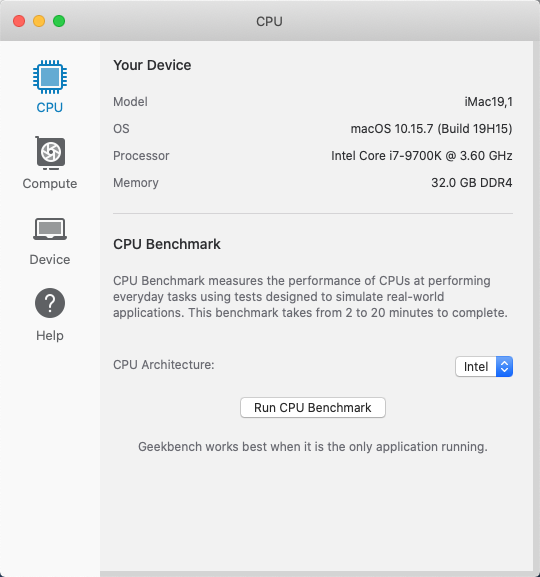
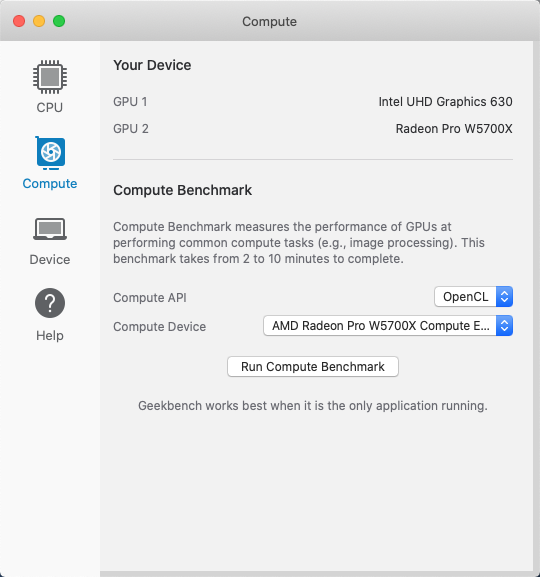
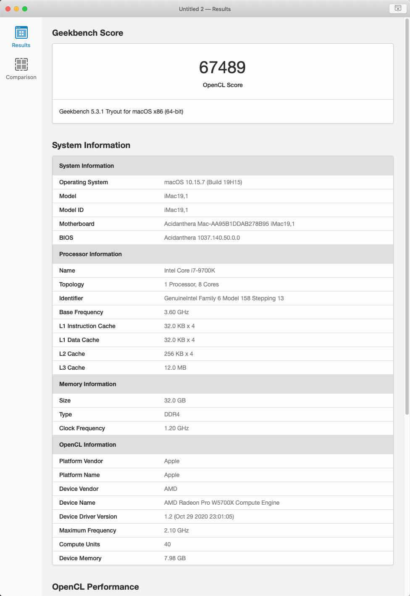
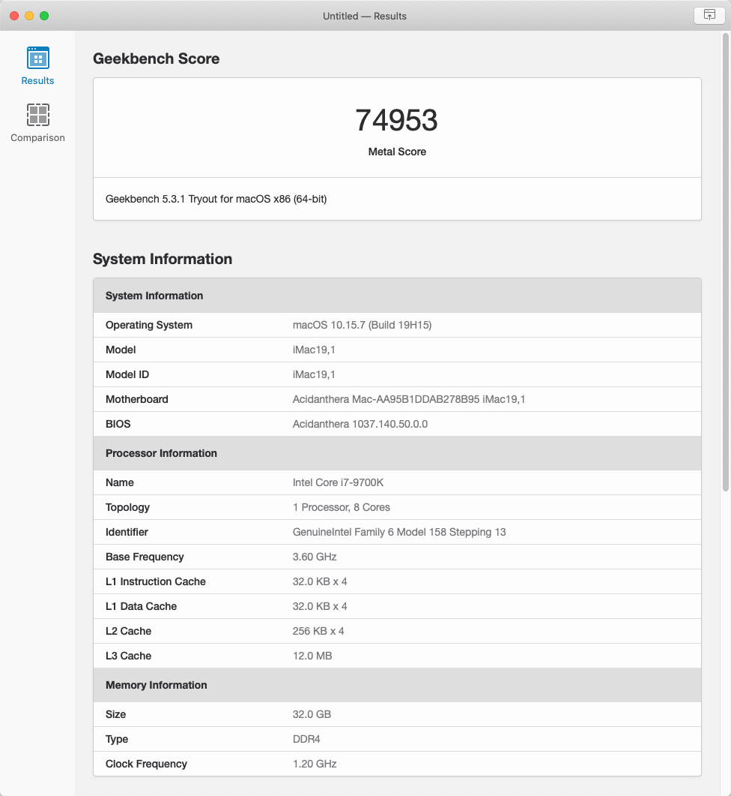
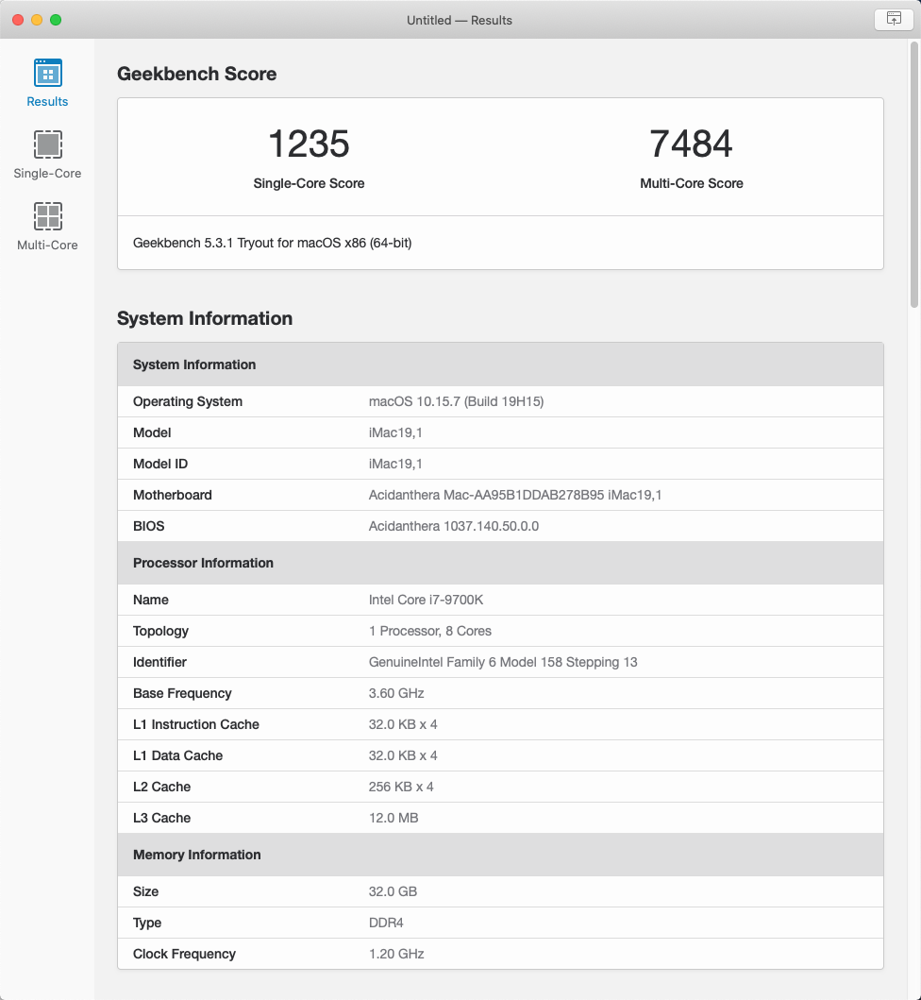
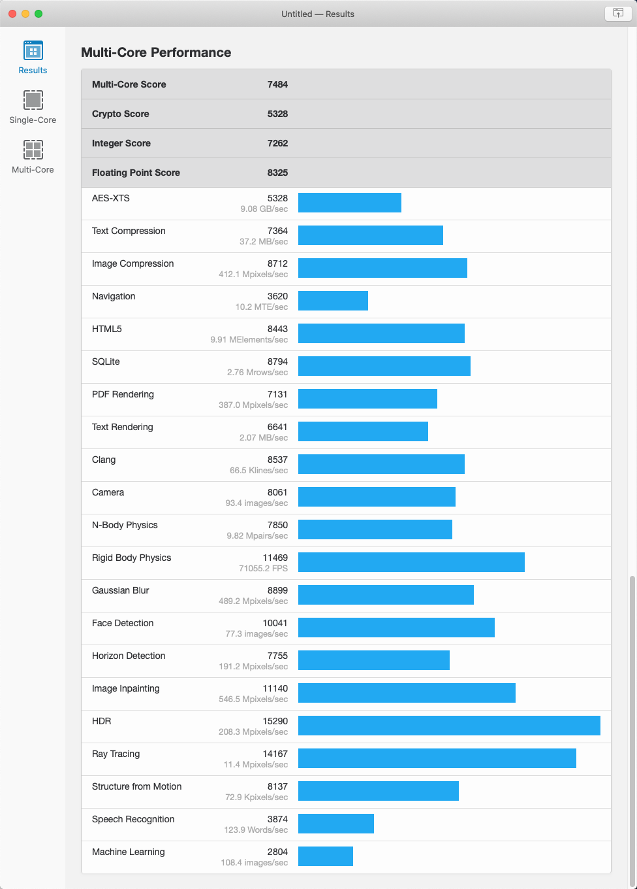

